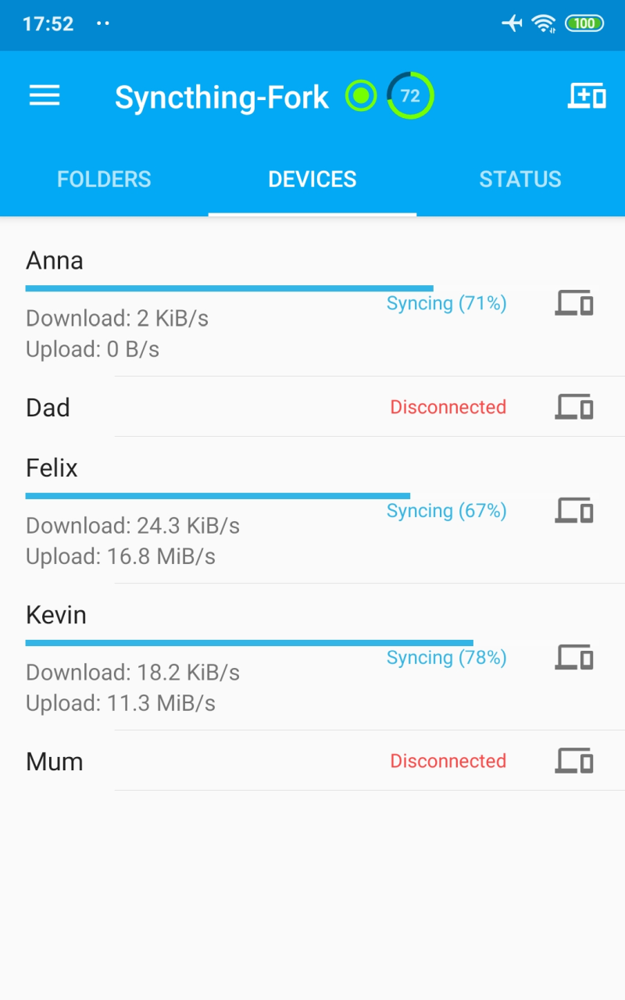
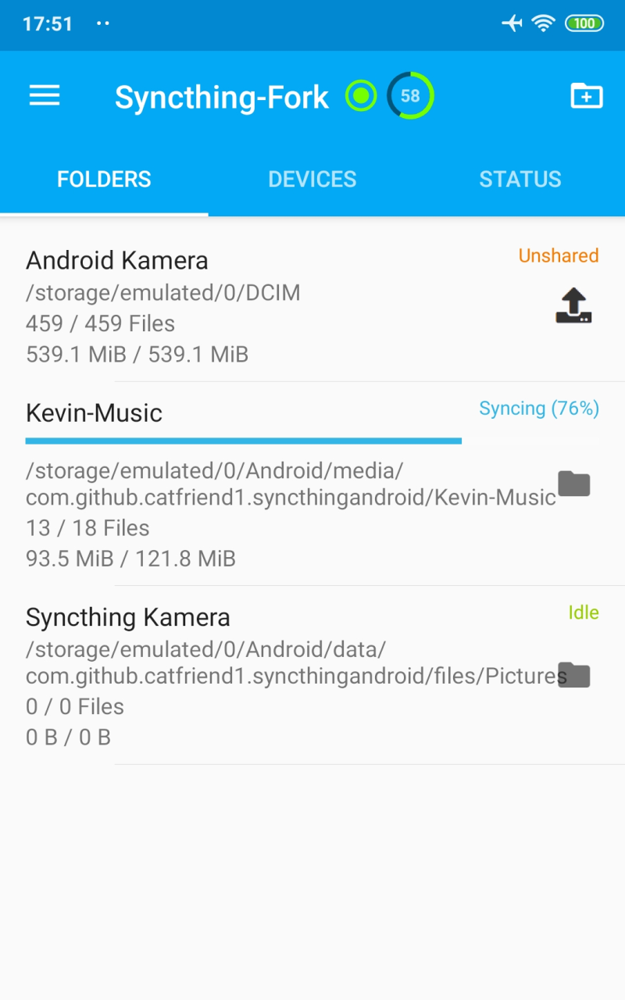
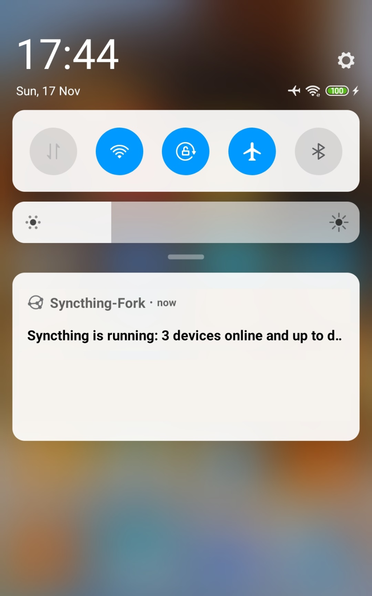

# Syncthing-Fork - A Syncthing Wrapper for Android

A wrapper of [Syncthing](https://github.com/syncthing/syncthing) for Android. Head to the "releases" section or F-Droid for builds. Please seek help on the forum and/or social media apps first before creating issues on the tracker.

 ·  · 

## Switching from the deprecated official version

Switching is easier than you may think! See our [wiki article](wiki/migration/Switching-from-the-deprecated-official-version.md) for detailed instructions.

## Wiki and Useful Articles

Our knowledge base is published [here](wiki#readme).

Our [release history and changelog](wiki/CHANGELOG.md) can be found on the wiki.

## Building and Development Notes

See [detailed info](wiki/developers/Building-and-Development.md).

## Acknowledgments

This project was forked from [syncthing/syncthing-android](https://github.com/syncthing/syncthing-android).

Special thanks to the former maintainers:

- [Catfriend1](https://github.com/Catfriend1)
- [imsodin](https://github.com/imsodin)
- [nutomic](https://github.com/nutomic)

## Privacy Policy

See our document on privacy: [privacy-policy.md](privacy-policy.md).

## License

The project is licensed under [MPLv2](LICENSE).
