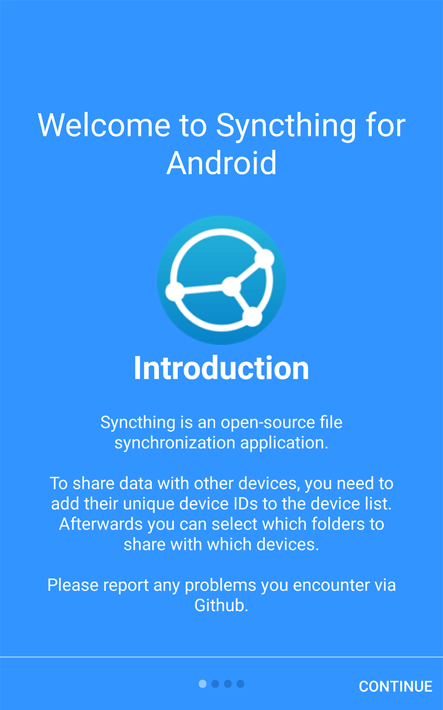
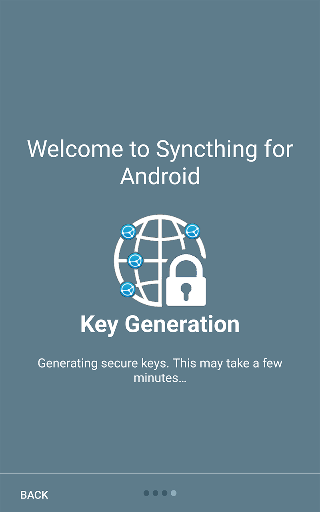
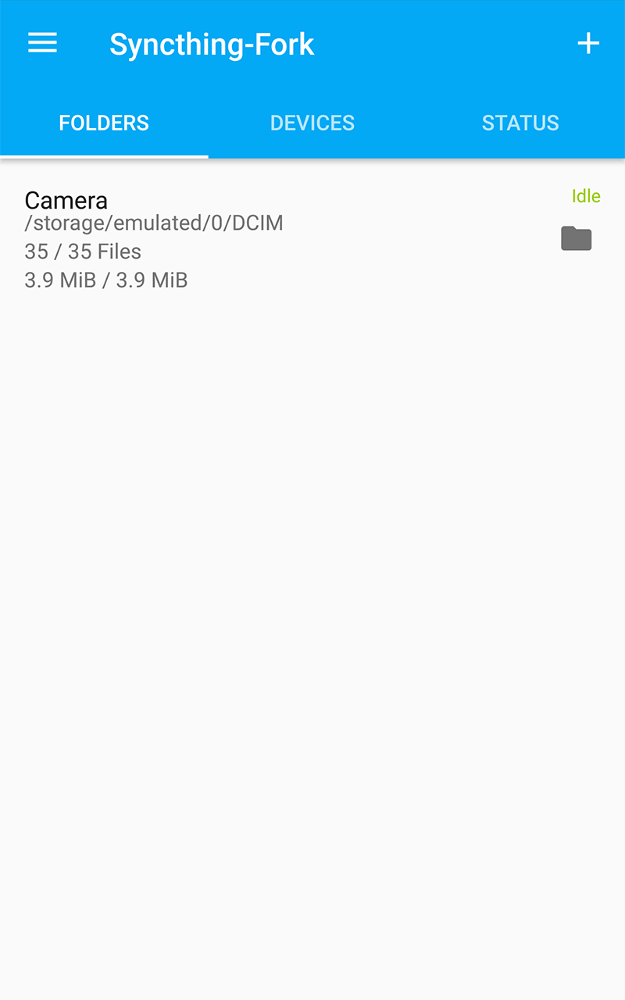

# Syncthing-Fork - A Syncthing Wrapper for Android:

[](https://opensource.org/licenses/MPL-2.0)
<a href="https://github.com/Catfriend1/syncthing-android/releases" alt="GitHub release"></a>
<a href="https://f-droid.org/packages/com.github.catfriend1.syncthingandroid" alt="F-Droid release"></a>
<a href="https://tooomm.github.io/github-release-stats/?username=Catfriend1&repository=syncthing-android" alt="GitHub Stats"></a>
<a href="https://hosted.weblate.org/projects/syncthing/android/catfriend1/"></a>

A wrapper of [Syncthing](https://github.com/syncthing/syncthing) for Android. Head to the "releases" section or F-Droid for builds. Please open an issue under this fork if you need help. Important: Please don't file bugs at the upstream repository "syncthing-android" if you are using this fork.

  

# Major enhancements in this fork are:
- Folder, device and overall sync progress can easily be read off the UI.
- "Syncthing Camera" - an optional feature (with optional permission to use the camera) where you can take pictures with your friend, partner, ... on two phones into one shared and private Syncthing folder. No cloud involved. (deprecated)
- "Sync every hour" to save even more battery
- Individual sync conditions can be applied per device and per folder (for expert users).
- Recent changes UI, click to open files.
- Changes to folder and device config can be made regardless if syncthing is running or not.
- UI explains why syncthing is running or not.
- "Battery eater" problem is fixed.
- Discover other Syncthing devices on the same network and easily add them.
- Supports two-way synchronization on external sd cards since Android 11.
- Supports encrypted folders on untrusted devices.

# Switching from the (now deprecated) official version

Switching is easier then you may think!

- On Syncthing on the official app, go into the settings and create a backup
- Confirm you can see that backup in your files
- Now stop the official app entirely using the system app settings for Syncthing (force stop the app basically - we need to ensure it's not running)
- Now start Syncthing-Fork
- In the Syncthing-Fork settings, restore the backup you created earlier
- Like magic, everything should be as it was in Syncthing official.
- Confirm everything looks good
- Uninstall the official Syncthing app

# About Play Store releases:
- Planning to close my Google Play Developer Account. Please say hi if you are interested in obtaining the latest gplay release files from me to help in publishing this app.

# Privacy Policy
See our document on privacy: [privacy-policy.md](https://github.com/Catfriend1/syncthing-android/blob/main/privacy-policy.md).

# Goal of the forked version
- Develop and try out enhancements together
- Release the wrapper more frequently to identify and fix bugs together caused by changes in the syncthing submodule
- Make enhancements configurable in the settings UI, e.g. users should be able to turn them on and off
- Let's get ready for newer Android versions that put limits on background syncing tools. We need your bug reports as detailed as possible

# Building

## Prerequisites

If you miss any prerequisite, the shell scripts will abort with an error and tell you what you need to do. In case you like to dive into building directly, you can skip this section and jump directly to "Build instructions".

- Android SDK
```
# This command will help you install the minimum Android SDK components to build this project in case you don't use Android Studio.
python install_minimum_android_sdk_prerequisites.py
```
- Android NDK r26b
```
$ANDROID_NDK_HOME environment variable should point at the root directory of your NDK. If the variable is not set, build-syncthing.py will automatically try to download and setup the NDK.
```
- Go 1.21.4
```
Make sure, Go is installed and available on the PATH environment variable. If Go is not found on the PATH environment variable, build-syncthing.py will automatically try to download and setup GO on the PATH.
```
- Python 3.9.6 64-Bit
```
Make sure, Python is installed and available on the PATH environment variable. Download 'https://www.python.org/ftp/python/3.9.6/python-3.9.6-amd64.exe' and run 'python-3.9.6-amd64.exe /quiet InstallAllUsers=1 PrependPath=1 Include_test=0'
```
- Git (for Linux) or Git for Windows
```
Make sure, git (or git.exe) is installed and available on the PATH environment variable. If Git is not found on the PATH environment variable, build-syncthing.py will automatically try to download and setup MinGit 2.19.0-x64 on the PATH.
```
- Java Development Version 17
```
"java" should be on the PATH environment variable. Download from Oracle and run the installer. Log off and back on to let the new PATH variable take effect.
```

## Build instructions

Edit "App_build_and_release.cmd" and set "SKIP_RELEASE_BUILD=1" if you don't need to upload signed releases to Google Play. This will simplify things for you.

### Build on Linux

A Linux VM, for example running Debian, is recommended to build this.

Build SyncthingNative and the Syncthing-Android wrapper using the following commands:
```
apt-get -y install git openjdk-11-jdk python
mkdir -p /root/work
cd /root/work
git clone https://github.com/Catfriend1/syncthing-android.git --recursive
cd /root/work/syncthing-android
./gradlew buildNative
./gradlew lint assembleDebug
```

You can also use Android Studio to build the apk after you manually ran the `./gradlew buildNative` command in the repository root.

To clean up all files generated during build, use the following commands:
```
./gradlew cleanNative
./gradlew clean
```

### Build on Windows

```
git clone https://github.com/Catfriend1/syncthing-android.git --recursive
cd /d "YOUR_CLONED_GIT_ROOT"
SyncthingNative_update_and_build
App_build_and_release
```

# Development Notes

It is recommended to change the GUI and Listen Address ports for the debug app, e.g. to 8385 and 22001 respectively.

The Syncthing native used for this android application provides a web interface by default. It can be accessed via the Settings menu -> 'Web GUI'. It is quite helpful to access this web interface from your development machine. Read android documentation on how to access the network of your emulator. Or use the following command to connect to the single currently running emulator/AVD.

adb forward tcp:18384 tcp:8384

Start Syncthing app on your emulator and access the web interface from you favorite browser of your development machine via https://127.0.0.1:18384

# License

The project is licensed under the [MPLv2](LICENSE).
