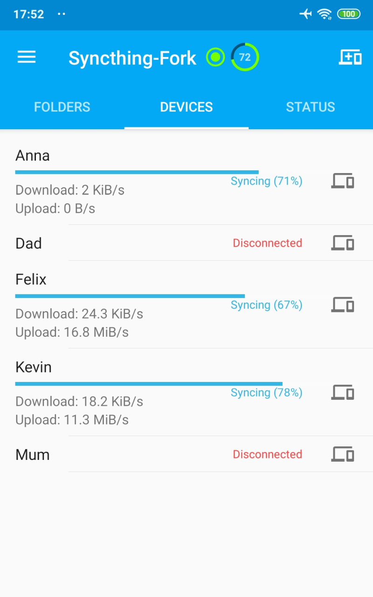
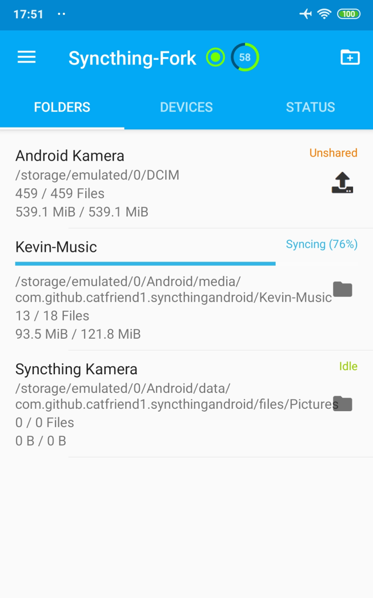
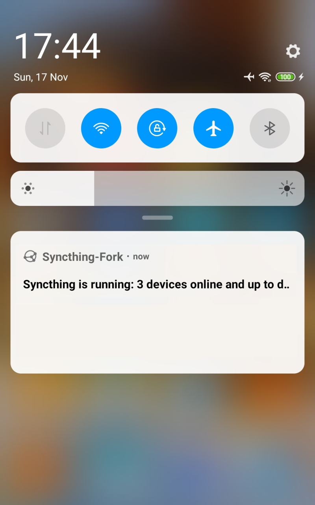

# Syncthing-Fork - A Syncthing Wrapper for Android

A wrapper of [Syncthing](https://github.com/syncthing/syncthing) for Android. Head to F-Droid or the "Releases" section on the GitHub repository for official releases published by Syncthing-Fork maintainer Catfriend1. The releases on Google Play are published by contributor nel0x. Please seek help on the forum and/or social media apps first before creating an issue on the issue tracker.

See [detailed info](https://github.com/Catfriend1/syncthing-android/blob/main/wiki/Switch-between-releases_Verify-APK-is-genuine.md) about release variants and see which one is recommended to fit your needs.

 ·  · 

## Switching from the official version
1. On Syncthing on the official app,
2. Go into the settings
3. Create a backup.
4. Stop Syncthing's foreground service or force stop the app (optional).
5. Install the latest version of Syncthing-Fork.
6. Start Syncthing-Fork.
7. Restore the backup you created earlier
8. Uninstall the official Syncthing app (optional)
9. Delete the Syncthing configuration backup (optional).

## Useful articles and wiki

Our knowledge base is published [here](https://github.com/Catfriend1/syncthing-android/tree/main/wiki#readme).

Our [release history and changelog](https://github.com/Catfriend1/syncthing-android/blob/main/wiki/CHANGELOG.md) can be found on the wiki.

## Building and development notes

See [detailed info](https://github.com/Catfriend1/syncthing-android/blob/main/wiki/Building-and-Development.md).

## Acknowledgments

This project was forked from [syncthing/syncthing-android](https://github.com/syncthing/syncthing-android).

Special thanks to the former maintainers:

- [imsodin](https://github.com/imsodin)
- [nutomic](https://github.com/nutomic)

## Privacy policy

See our privacy policy: [privacy-policy.md](https://github.com/Catfriend1/syncthing-android/blob/main/privacy-policy.md).

## License

Syncthing-Fork is licensed under [MPLv2](LICENSE).
